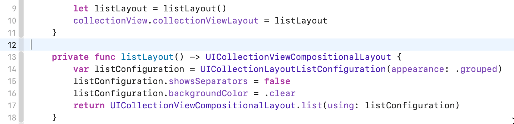
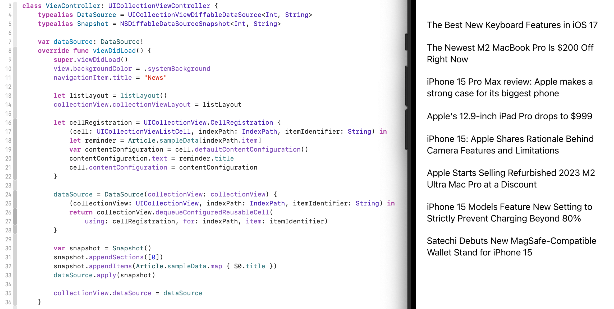
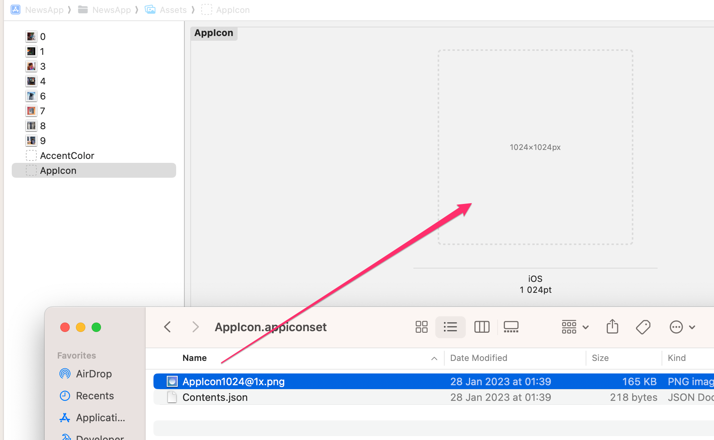

#  News App

[Tutorial](https://developer.apple.com/tutorials/app-dev-training/getting-started-with-today)

добавил картинки

[Model/Article.swift](https://raw.githubusercontent.com/VladimirFibe/Swift/main/UIKit/UIResponder/UIView/UIScrollView/UICollectionView/NewsApp/NewsApp/Model/Article.swift)

